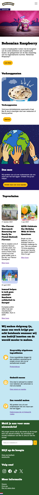

# Procesverslag
Markdown is een simpele manier om HTML te schrijven.  
Markdown cheat cheet: [Hulp bij het schrijven van Markdown](https://github.com/adam-p/markdown-here/wiki/Markdown-Cheatsheet).

Nb. De standaardstructuur en de spartaanse opmaak van de README.md zijn helemaal prima. Het gaat om de inhoud van je procesverslag. Besteedt de tijd voor pracht en praal aan je website.

Nb. Door *open* toe te voegen aan een *details* element kun je deze standaard open zetten. Fijn om dat steeds voor de relevante stuk(ken) te doen.

## Jij

  
uitwerken voor kick-off werkgroep

  ### Auteur:
  Nathan van Munster

  #### Je startniveau:
  blauw & rood

  #### Je focus:
  surface plane
 

## Je website

  
uitwerken voor kick-off werkgroep

  ### Je opdracht:
  https://www.benjerry.nl 

  #### Screenshot(s) van de eerste pagina (small screen): 
  Ben & Jerry's home screen
  
  
  
  
  
  
  
  
  
  

  #### Screenshot(s) van de tweede pagina (small screen):
  Waar koop ik ben & jerry's?  
  
  
  
  
  
  
  
 

## Toegankelijkheidstest 1/2 (week 1)

  
uitwerken na test in 2e werkgroep

  ### Bevindingen
  Lijst met je bevindingen die in de test naar voren kwamen:

  1. missende of onvolledige alt tekst bij images. voor gebruikers met een screenreader is het essentieel om te kunnen bergijpen wat zo een image voorstelt. 

  2. Formulieren en invoervelden zonder duidelijke labels.

  3. Navigatie die niet toegankelijk is zonder toetsenbord. Mensen met een motorische beperking moeten zonder muis een website kunnen gebruiken. 

## Breakdownschets (week 1)

  
uitwerken na afloop 3e werkgroep

  ### de hele pagina: 
  

  ### dynamisch deel (bijv menu): 
  

## Voortgang 1 (week 2)

  
uitwerken voor 1e voortgang

  ### Stand van zaken
  Het opzetten van de html ging eigenlijk best wel goed. Ik twijfel alleen een beetje aan hoe semantisch mijn code is. Ik was ook al een beetje begonnen met css maar dat gaat nog lastig. Javascript heb ik het begin van een hamburger menu opgezet. Dit werd in de les uitgelegd. De opdrachten gaan mij tot nu toe goed af. 

  ### Agenda voor meeting
  samen met je groepje opstellen

  | Nathan         | Zoë                | Artemis      | Tess             |
  | ---            | ---                | ---          | ---              |
  | Html bespreken | voortga            | voortgang    |  voortgang       |
  |                |                    |              |                  |
  |                |                    |              |                  |

  ### Verslag van meeting
  hier na afloop snel de uitkomsten van de meeting vastleggen

  - Mijn html bleek redelijk semantisch te zijn. Hier en daar een aantal foutjes die nu opgelost zijn. Ik had een aantal classes en divs die niet juist waren. Ik ben lekker op weg.

## Voortgang 2 (week 3)

  
uitwerken voor 2e voortgang

  ### Stand van zaken
  Ik heb de tweede pagina gemaakt met html. de tweede pagina had meer forms en andere soorten elementen die ik nog nooit gecodeert had. 

  ### Verslag van meeting
  hier na afloop snel de uitkomsten van de meeting vastleggen

  - Ik had een aantal sections en articles die net niet helemaal goed stonden of onnidig waren. voor de rest zag mijn code er goed uit. Ik had wat vragen gesteld over de css en die zijn beantwoord.
  - De onnodige divs en classes heb ik weg gehaald en dat ziet er nu goed uit.

## Toegankelijkheidstest 2/2 (week 4)

  
uitwerken na test in 9e werkgroep

  ### Bevindingen
  Lijst met je bevindingen die in de test naar voren kwamen (geef ook aan wat er verbeterd is):

  De echte Ben & Jerry's site:

  1. missende of onvolledige alt tekst bij images. voor gebruikers met een screenreader is het essentieel om te kunnen bergijpen wat zo een image voorstelt. 

  2. Formulieren en invoervelden zonder duidelijke labels.

  3. Navigatie die niet toegankelijk is zonder toetsenbord. Mensen met een motorische beperking moeten zonder muis een website kunnen gebruiken. 

  4. De voiceover werkt heel duidelijk op de site van ben&jerry's. Het viel mij op dat het hamburger menu helemaal werd uitgelegd. 

  5. De site van Ben & Jerry's zit qua responsiveness heel goed in elkaar. de navigatie verdwijnt mooi in het hamburger menu wanneer je de site op telefoon opent. 

  6. De site van ben & jerry's heeft geen interactieve media. Het is een goede maar hele standaard website. 

  Mijn nagemaakte site:

  1. Al mijn images hebben een duidelijke alt beschrijving waardoor mensen met een beperkt zicht goed kunnen begrijpen hoe de pagina eruit ziet.

  2. Alle sections en articles worden op de juiste manier voorgelezen via de voiceover. 

  3. Mijn html is volgens de validator helemaal semantisch. 

  4. De originele site heeft geen darkmode en mijn nagemaakte site wel.

  Ik heb de WCAG checklist test zelf gedaan op mijn eigen site. De ondervindingen heb ik bij de remarks gezet op de test. Tijdens het doen van de test kwam ik erachter dat eigenlijk toch redelijk wat onderdelen van mijn site nog niet in orde waren. Na afloop van de test heb ik dat aangepast en nu is de code in orde. 
  
  
  

## Voortgang 3 (week 4)

  
uitwerken voor 3e voortgang

  ### Stand van zaken
  Ik ben heel ver met de site. Ik vind het eigenlijk best leuk om de site na te coderen. Ik heb nu volledig de html van beide paginas en ben bijna klaar met de css. Nog een paar kleine grid probleempjes maar het moet lukken. Ik ben nu vooral bezig met de surface plane uitdagingen. Zo heb ik een darkmode met javascript gemaakt met behulp van w3s.

  ### Agenda voor meeting
  Dit voortgangsgesprek ging niet door vanwege ziekte bij docent en studentassistent

## Eindgesprek (week 5)

  
uitwerken voor eindgesprek

  ### Je uitkomst - karakteristiek screenshots:
  
  

  ### Dit ging goed/Heb ik geleerd: 
  Ik heb erg veel geleerd tijdens dit vak. Ik heb het gevoel dat ik nu de basis van html en css echt wel goed begrijp. Ik ben zelf erg tevreden over de site die ik heb gemaakt. Het opzetten van de html ging eigenlijk verrassend snel en makkelijk, de css vond ik denk ik het lastigst en de javascript verliep ook best makkelijk. Ik volg dit blok namelijk ook inleiding programmeren dus de js-3-stap was goed te doen. Ik had eigenlijk mijn site responsive willen maken omdat mij dat eigenlijk vetter leek dan een aantal surface plane onderwerpen. Maar vanwege angst dat het me niet zou lukken leek het mij slimmer om aan de gang te gaan met iets waarvan ik wist dat het sowieso wel goed moest komen. 

  surface plane die ik in mijn site heb verwerkt: 

  1. custom theme: light/dark mode.
  2. animatie: ijsje wat draait.
  3. complete micro interactie: hamburger menu.
  4. Dom manimpulatie: Hamburger menu en dark/light mode.
  5. toegankelijkheid++: Semantische html, alt teksten op images, buttons die buttons zijn met een hover en forms en zoekvelden met labels.
  6. Prefers reduced motion: ijsje draait niet wanneer gebruiker dat aan heeft staan.

 

  ### Dit was lastig/Is niet gelukt:
  Het was mij niet gelukt om bij de darkmode de kleuren die ik had toegewezen aan bepaalde sections ook te laten mee veranderen in zwart. Ik denk dat het ligt aan dat ik de sections specifiek heb aangeroepen en die een kleur heb toegewezen en dat die dus de zwarte kleur overschrijft. Denk dat het mij wel gelukt was als ik meer tijd had.

  

## Bronnenlijst

  
continu bijhouden terwijl je werkt

  Nb. Wees specifiek ('css-tricks' als bron is bijv. niet specifiek genoeg). 
  Nb. ChatGpT en andere AI horen er ook bij.
  Nb. Vermeld de bronnen ook in je code.

  1. https://www.w3schools.com/css/css_text.asp 
  2. https://www.w3schools.com/css/css3_borders.asp
  3. https://www.w3schools.com/tags/tag_select.asp
  4. https://www.w3schools.com/bootstrap/bootstrap_dropdowns.asp
  5. https://developer.mozilla.org/en-US/docs/Web/HTML/Reference/Elements/input/search
  6. Het maken van een zoekbalk met css: https://www.w3schools.com/howto/howto_css_searchbar.asp
  7. https://stackoverflow.com/questions/14615712/toggle-classname-onclick-javascript
  8. https://developer.mozilla.org/en-US/docs/Web/API/Element/click_event
  9. Javascript over het onclick en click event van bijvoorbeeld de darkmode button: https://www.w3schools.com/jsref/event_onclick.asp
  10. Hoe zit een placeholder in elkaar: https://developer.mozilla.org/en-US/docs/Web/HTML/Reference/Attributes/placeholder
  11. Hoe zit een placeholder in elkaar: https://www.w3schools.com/tags/att_input_placeholder.asp 
  12. Wanneer gebruik je articles: https://developer.mozilla.org/en-US/docs/Web/HTML/Reference/Elements/article
  13. Dark-mode gemaakt aan de hand van deze bron: https://www.w3schools.com/howto/howto_js_toggle_dark_mode.asp 
  14. Vragen aan chatgpt als: Is mijn code nu semantisch correct? Vaak was het antwoord nee. Met de darkmode overwrite het de kleuren die ik bepaalde secties in mijn body heb gegeven niet hoe kan ik dat fixen? begreep het na uitleg half maar zag eruit als iets wat veel tijd zou kosten. Is mijn javascript nu semantisch? Je spreekt niet over semantiek met javascript. Voldoet mijn code aan de volgende eisen? ja.
  
  

